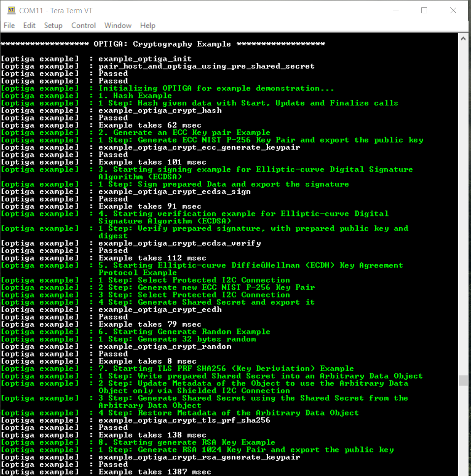

# OPTIGA&trade;: Cryptography

This example uses an OPTIGA&trade; Trust M v3 secure element on a PSOC&trade; 6 MCU to execute example code to perform available crypto operations on the secure element. This example outputs the result and the time taken to perform the crypto operations in a UART terminal.

[View this README on GitHub.](https://github.com/Infineon/mtb-example-optiga-crypto)

[Provide feedback on this code example.](https://cypress.co1.qualtrics.com/jfe/form/SV_1NTns53sK2yiljn?Q_EED=eyJVbmlxdWUgRG9jIElkIjoiQ0UyMzM2OTMiLCJTcGVjIE51bWJlciI6IjAwMi0zMzY5MyIsIkRvYyBUaXRsZSI6Ik9QVElHQSZ0cmFkZTs6IENyeXB0b2dyYXBoeSIsInJpZCI6Inl1c2hldiIsIkRvYyB2ZXJzaW9uIjoiMi4yLjAiLCJEb2MgTGFuZ3VhZ2UiOiJFbmdsaXNoIiwiRG9jIERpdmlzaW9uIjoiTi9BIiwiRG9jIEJVIjoiTi9BIiwiRG9jIEZhbWlseSI6Ik4vQSJ9)


## Requirements

- [ModusToolbox&trade;](https://www.infineon.com/modustoolbox) v3.1 or later (tested with v3.1)
- Board support package (BSP) minimum required version: 4.0.0
- Programming language: C
- Associated parts:
  - All [PSOC&trade; 6 MCU](https://www.infineon.com/PSOC6) parts
  - [OPTIGA&trade; Trust M v3](https://www.infineon.com/optiga-trust-m)


## Supported toolchains (make variable 'TOOLCHAIN')

- GNU Arm&reg; Embedded Compiler v11.3.1 (`GCC_ARM`) - Default value of `TOOLCHAIN`
- Arm&reg; Compiler v6.16 (`ARM`)
- IAR C/C++ Compiler v9.30.1 (`IAR`)


## Supported kits (make variable 'TARGET')

- Rapid IoT connect Developer Kit (`CYSBSYSKIT-DEV-01`) - Default value of `TARGET`
- [PSOC&trade; 62S2 Evaluation Kit](https://www.infineon.com/CY8CEVAL-062S2) (`CY8CEVAL-062S2`, `CY8CEVAL-062S2-LAI-43439M2`, `CY8CEVAL-062S2-LAI-4373M2`, `CY8CEVAL-062S2-MUR-43439M2`, `CY8CEVAL-062S2-MUR-4373EM2`)
- [PSOC&trade; 62S2 Pioneer Kit](https://www.infineon.com/cms/en/product/evaluation-boards/cy8ckit-062s2-43012/) in combination with [OPTIGA&trade; Trust Adapter](https://www.infineon.com/cms/en/product/evaluation-boards/optiga-trust-adapter/) (`CY8CKIT-062S2-43012`)

To use this code example on different hardware, follow this [guide](https://community.infineon.com/t5/Blogs/Interfacing-OPTIGA-Trust-M-with-a-PSOC-6-device/ba-p/361647).
To use kits which are based on the [OPTIGA&trade; Trust M Express](https://www.infineon.com/cms/en/product/evaluation-boards/trust-m-express-shield/) or [OPTIGA&trade; Trust M MTR](https://www.infineon.com/cms/en/product/evaluation-boards/trust-m-mtr-shield/) Shields, read the [Enabling the Shielded Connection](#enabling-the-shielded-connection) Section carefully.


## Hardware setup

This example uses the board's default configuration for all the supported kits except [CY8CKIT-062S2-43012](https://www.infineon.com/cms/en/product/evaluation-boards/cy8ckit-062s2-43012/). This kit requires the [OPTIGA&trade; Trust Adapter](https://www.infineon.com/cms/en/product/evaluation-boards/optiga-trust-adapter/) and any OPTIGA&trade; Trust M Shield (e.g. [OPTIGA&trade; Trust M Express](https://www.infineon.com/cms/en/product/evaluation-boards/trust-m-express-shield/) or [OPTIGA&trade; Trust M MTR](https://www.infineon.com/cms/en/product/evaluation-boards/trust-m-mtr-shield/)) to be plugged on it. See the kit user guide to ensure that the board is configured correctly


## Software setup

See the [ModusToolbox&trade; tools package installation guide](https://www.infineon.com/ModusToolboxInstallguide) for information about installing and configuring the tools package.

Install a terminal emulator if you don't have one. Instructions in this document use [Tera Term](https://teratermproject.github.io/index-en.html).


## Enabling the shielded connection

By default, the shielded connection (encrypted communication over I2C) is disabled to improve the out-of-the-box experience.
However, the security of some examples would benefit from having the shielded connection enabled.

The shielded connection requires a shared "Platform Binding Secret" (PBS) on the Host MCU and the OPTIGA&trade; Trust M, which will be used for a session-based key-derivation and following encryption of the I2C. [Read more here](https://community.infineon.com/t5/Knowledge-Base-Articles/OPTIGA-Trust-M-Shielded-connection/ta-p/354380)

The shielded connection can be enabled by uncommenting the macro `#define OPTIGA_COMMS_SHIELDED_CONNECTION` in *optiga_lib_config_mtb.h*.

The OPTIGA&trade; Trust M (v3) comes without a pre-provisioned PBS, meaning it can generate one at runtime and work out-of-the-box with this example.

[OPTIGA&trade; Trust M Express](https://www.infineon.com/cms/en/product/evaluation-boards/trust-m-express-shield/) and [OPTIGA&trade; Trust M MTR](https://www.infineon.com/cms/en/product/evaluation-boards/trust-m-mtr-shield/) come with a pre-provisioned PBS. This PBS must also be known to the host if the shielded connection will be used. If you want to use it in combination with OPTIGA&trade; Trust M Express or MTR chips, remember to set the matching secret `uint8_t optiga_platform_binding_shared_secret` in *COMPONENT_OPTIGA_CYHAL/pal_os_datastore.c*. If some examples report a failure with error code `0x0107` this is due to a non-matching PBS on the host and OPTIGA&trade; Trust M.


## Using the code example

### Create the project

The ModusToolbox&trade; tools package provides the Project Creator as both a GUI tool and a command line tool.

<details><summary><b>Use Project Creator GUI</b></summary>

1. Open the Project Creator GUI tool.

   There are several ways to do this, including launching it from the dashboard or from inside the Eclipse IDE. For more details, see the [Project Creator user guide](https://www.infineon.com/ModusToolboxProjectCreator) (locally available at *{ModusToolbox&trade; install directory}/tools_{version}/project-creator/docs/project-creator.pdf*).

2. On the **Choose Board Support Package (BSP)** page, select a kit supported by this code example. See [Supported kits](#supported-kits-make-variable-target).

   > **Note:** To use this code example for a kit not listed here, you may need to update the source files. If the kit does not have the required resources, the application may not work.

3. On the **Select Application** page:

   a. Select the **Applications(s) Root Path** and the **Target IDE**.

   > **Note:** Depending on how you open the Project Creator tool, these fields may be pre-selected for you.

   b.	Select this code example from the list by enabling its check box.

   > **Note:** You can narrow the list of displayed examples by typing in the filter box.

   c. (Optional) Change the suggested **New Application Name** and **New BSP Name**.

   d. Click **Create** to complete the application creation process.

</details>

<details><summary><b>Use Project Creator CLI</b></summary>

The 'project-creator-cli' tool can be used to create applications from a CLI terminal or from within batch files or shell scripts. This tool is available in the *{ModusToolbox&trade; install directory}/tools_{version}/project-creator/* directory.

Use a CLI terminal to invoke the 'project-creator-cli' tool. On Windows, use the command-line 'modus-shell' program provided in the ModusToolbox&trade; installation instead of a standard Windows command-line application. This shell provides access to all ModusToolbox&trade; tools. You can access it by typing "modus-shell" in the search box in the Windows menu. In Linux and macOS, you can use any terminal application.

The following example clones the "[mtb-example-optiga-crypto](https://github.com/Infineon/mtb-example-optiga-crypto)" application with the desired name "OptigaCrypto" configured for the *CYSBSYSKIT-DEV-01* BSP into the specified working directory, *C:/mtb_projects*:

   ```
   project-creator-cli --board-id CYSBSYSKIT-DEV-01 --app-id mtb-example-optiga-crypto --user-app-name OptigaCrypto --target-dir "C:/mtb_projects"
   ```

The 'project-creator-cli' tool has the following arguments:

Argument | Description | Required/optional
---------|-------------|-----------
`--board-id` | Defined in the <id> field of the [BSP](https://github.com/Infineon?q=bsp-manifest&type=&language=&sort=) manifest | Required
`--app-id`   | Defined in the <id> field of the [CE](https://github.com/Infineon?q=ce-manifest&type=&language=&sort=) manifest | Required
`--target-dir`| Specify the directory in which the application is to be created if you prefer not to use the default current working directory | Optional
`--user-app-name`| Specify the name of the application if you prefer to have a name other than the example's default name | Optional

> **Note:** The project-creator-cli tool uses the `git clone` and `make getlibs` commands to fetch the repository and import the required libraries. For details, see the "Project creator tools" section of the [ModusToolbox&trade; tools package user guide](https://www.infineon.com/ModusToolboxUserGuide) (locally available at {ModusToolbox&trade; install directory}/docs_{version}/mtb_user_guide.pdf).

</details>


### Open the project

After the project has been created, you can open it in your preferred development environment.


<details><summary><b>Eclipse IDE</b></summary>

If you opened the Project Creator tool from the included Eclipse IDE, the project will open in Eclipse automatically.

For more details, see the [Eclipse IDE for ModusToolbox&trade; user guide](https://www.infineon.com/MTBEclipseIDEUserGuide) (locally available at *{ModusToolbox&trade; install directory}/docs_{version}/mt_ide_user_guide.pdf*).

</details>


<details><summary><b>Visual Studio (VS) Code</b></summary>

Launch VS Code manually, and then open the generated *{project-name}.code-workspace* file located in the project directory.

For more details, see the [Visual Studio Code for ModusToolbox&trade; user guide](https://www.infineon.com/MTBVSCodeUserGuide) (locally available at *{ModusToolbox&trade; install directory}/docs_{version}/mt_vscode_user_guide.pdf*).

</details>


<details><summary><b>Keil µVision</b></summary>

Double-click the generated *{project-name}.cprj* file to launch the Keil µVision IDE.

For more details, see the [Keil µVision for ModusToolbox&trade; user guide](https://www.infineon.com/MTBuVisionUserGuide) (locally available at *{ModusToolbox&trade; install directory}/docs_{version}/mt_uvision_user_guide.pdf*).

</details>


<details><summary><b>IAR Embedded Workbench</b></summary>

Open IAR Embedded Workbench manually, and create a new project. Then select the generated *{project-name}.ipcf* file located in the project directory.

For more details, see the [IAR Embedded Workbench for ModusToolbox&trade; user guide](https://www.infineon.com/MTBIARUserGuide) (locally available at *{ModusToolbox&trade; install directory}/docs_{version}/mt_iar_user_guide.pdf*).

</details>


<details><summary><b>Command line</b></summary>

If you prefer to use the CLI, open the appropriate terminal, and navigate to the project directory. On Windows, use the command-line 'modus-shell' program; on Linux and macOS, you can use any terminal application. From there, you can run various `make` commands.

For more details, see the [ModusToolbox&trade; tools package user guide](https://www.infineon.com/ModusToolboxUserGuide) (locally available at *{ModusToolbox&trade; install directory}/docs_{version}/mtb_user_guide.pdf*).

</details>


## Operation

1. Connect the board to your PC using the provided USB cable through the KitProg3 USB connector.

2. Open a terminal program and select the KitProg3 COM port. Set the serial port parameters to 8N1 and 115200 baud.

3. Program the board using one of the following:

   <details><summary><b>Using Eclipse IDE</b></summary>

      1. Select the application project in the Project Explorer.

      2. In the **Quick Panel**, scroll down, and click **\<Application Name> Program (KitProg3_MiniProg4)**.
   </details>


   <details><summary><b>In other IDEs</b></summary>

   Follow the instructions in your preferred IDE.
   </details>


   <details><summary><b>Using CLI</b></summary>

     From the terminal, execute the `make program` command to build and program the application using the default toolchain to the default target. The default toolchain is specified in the application's Makefile but you can override this value manually:
      ```
      make program TOOLCHAIN=<toolchain>
      ```

      Example:
      ```
      make program TOOLCHAIN=GCC_ARM
      ```
   </details>

4. After programming, the application starts automatically. Confirm that the following examples are displayed on the UART terminal.


   **Figure 1. Terminal output on program startup**

   


## Debugging

You can debug the example to step through the code.


<details><summary><b>In Eclipse IDE</b></summary>

Use the **\<Application Name> Debug (KitProg3_MiniProg4)** configuration in the **Quick Panel**. For details, see the "Program and debug" section in the [Eclipse IDE for ModusToolbox&trade; user guide](https://www.infineon.com/MTBEclipseIDEUserGuide).

> **Note:** **(Only while debugging)** On the CM4 CPU, some code in `main()` may execute before the debugger halts at the beginning of `main()`. This means that some code executes twice – once before the debugger stops execution, and again after the debugger resets the program counter to the beginning of `main()`. See [KBA231071](https://community.infineon.com/docs/DOC-21143) to learn about this and for the workaround.

</details>


<details><summary><b>In other IDEs</b></summary>

Follow the instructions in your preferred IDE.
</details>


## Design and implementation

This example initializes the OPTIGA&trade; Trust device by calling a dedicated function from the Platform Abstraction Layer (PAL). This function initializes all hardware- and system-relevant components. Afterwards, the example sequentially calls isolated sub-examples to showcase various API combinations.

All examples follow the same pattern `init` function, `do_crypto` function, and an optional `deinit` function. The following snippets provide an overview:

```c
void example_main(void)
{
   uint8_t random_data_buffer [32];
   optiga_crypt_t * me_crypt_instance = NULL;
   optiga_lib_status_t return_status = !OPTIGA_LIB_SUCCESS;

   do
   {
      /*
      * Step 1. Initialize the OPTIGA device
      */
      example_optiga_init();

      /*
      * Step 2. Create an instance of optiga_crypt to perform any crypto operation on the OPTIGA device.
      */
      me_crypt_instance = optiga_crypt_create(0, optiga_lib_callback, NULL);
      if (NULL == me_crypt_instance)
      {
            break;
      }

      /*
      * Step 3..n-1. Perform any operation with the OPTIGA device; e.g., get a true random number.
      * random_data_buffer should contain the resulting random number.
      */
      optiga_lib_status = OPTIGA_LIB_BUSY;
      return_status = optiga_crypt_random(me_crypt_instance,
                                          OPTIGA_RNG_TYPE_TRNG,
                                          random_data_buffer,
                                          sizeof(random_data_buffer));

      WAIT_AND_CHECK_STATUS(return_status, optiga_lib_status);

      /* Step n. De-initialize the OPTIGA device. This step is optional in many cases because some resources on MCU-based systems cannot be de-initialized.
      */
      example_optiga_deinit();
   } while (FALSE);
}
```

OPTIGA&trade; `init` and `deinit` functions simply allocate a new command context and send an `OpenApplication` command to the chip. The `while` loop is required to synchronize the state machine. The application is free to implement this differently and check the status occasionally; the rest might be in an idle state.

```c
#include "optiga/optiga_crypt.h"
#include "optiga/optiga_util.h"
#include "optiga/optiga_lib_config.h"


optiga_util_t * me_util_instance = NULL;
optiga_crypt_t * me_crypt_instance = NULL;

/**
 * Callback when optiga_util_xxxx operation is completed asynchronously
 */
static volatile optiga_lib_status_t optiga_lib_status;
//lint --e{818} suppress "argument "context" is not used in the sample provided"
static void optiga_lib_callback(void * context, optiga_lib_status_t return_status)
{
   optiga_lib_status = return_status;
   if (NULL != context)
   {
      // callback to upper layer here
   }
}

// Check return status
#define WAIT_AND_CHECK_STATUS(return_status, optiga_lib_status)\
                            if (OPTIGA_LIB_SUCCESS != return_status)\
                            {\
                                break;\
                            }\
                            while (OPTIGA_LIB_BUSY == optiga_lib_status)\
                            { }\
                            if (OPTIGA_LIB_SUCCESS != optiga_lib_status)\
                            {\
                                return_status = optiga_lib_status;\
                                break;\
                            }

void example_optiga_init(void)
{
    optiga_lib_status_t return_status = !OPTIGA_LIB_SUCCESS;

    do
    {
        if (NULL == me_util_instance)
        {
           /*
           Create an instance of optiga_util to open the application on the OPTIGA device.
           */
           me_util_instance = optiga_util_create(0, optiga_lib_callback, NULL);
           if (NULL == me_util_instance)
           {
               break;
           }
        }

        /**
         * Open the application on the OPTIGA device which is a precondition to perform any other operations
         * using the optiga_util_open_application.
         */
        optiga_lib_status = OPTIGA_LIB_BUSY;
        return_status = optiga_util_open_application(me_util_instance, 0);

        WAIT_AND_CHECK_STATUS(return_status, optiga_lib_status);

    }while(FALSE);
}

void example_optiga_deinit(void)
{
    optiga_lib_status_t return_status = !OPTIGA_LIB_SUCCESS;

    do
    {
        /**
         * Close the application on the OPTIGA device after all the operations are executed
         * using optiga_util_close_application.
         */
        optiga_lib_status = OPTIGA_LIB_BUSY;
        return_status = optiga_util_close_application(me_util_instance, 0);

        WAIT_AND_CHECK_STATUS(return_status, optiga_lib_status);

        // Destroy util and crypt instances
        optiga_util_destroy(me_util_instance);
        me_util_instance = NULL;
    }while(FALSE);
}
```


### Resources and settings

**Table 1: OPTIGA&trade; Trust M pins and their default-assigned GPIOs**

 OPTIGA&trade; Trust M pins  | Assigned GPIOs by default | Notes
 --------------------- | ------------------------- | ------
 I2C SDA (I/O) | CYBSP_TRUSTM_I2C_SDA | Any GPIO connected to the I2C SDA line can be used
 I2C SCL (Clock) | CYBSP_TRUSTM_I2C_SCL | Any GPIO connected to the I2C SDA line can be used
 RST (Reset) | CYBSP_TRUSTM_RST | An optional control pin if defined in [*optiga_lib_config_mtb.h*](source/optiga_lib_config_mtb.h)
 VDD (Power control) | (Optional) CYBSP_TRUSTM_VDD | An optional control pin if defined in [*optiga_lib_config_mtb.h*](source/optiga_lib_config_mtb.h)

<br>

**Table 2: Description of *optiga_lib_config_mtb.h* macros**

 [*optiga_lib_config_mtb.h*](source/optiga_lib_config_mtb.h) macros  | Description  | Default value
  ---------------- | ------------- | ---------
 `OPTIGA_CRYPT_XXXX` | Controls whether to enable or disable the selected crypto support on the host library side | All enabled
 `OPTIGA_COMMS_SHIELDED_CONNECTION`, `OPTIGA_COMMS_DEFAULT_PROTECTION_LEVEL` | Together define whether to use the shielded connection (encrypted and integrity-protected I2C communication) and the extent of its usage | Defined 
`OPTIGA_COMMS_SHIELDED_CONNECTION` | If this and the `OPTIGA_COMMS_DEFAULT_PROTECTION_LEVEL` macro are set to `OPTIGA_COMMS_NO_PROTECTION`, the user must decide the API to protect and the extent of protection right before that API is called by calling `OPTIGA_CRYPT_SET_COMMS_PROTECTION_LEVEL()` and `OPTIGA_CRYPT_SET_COMMS_PROTOCOL_VERSION()` | `OPTIGA_COMMS_SHIELDED_CONNECTION`: Defined <br> `OPTIGA_COMMS_DEFAULT_PROTECTION_LEVEL`: Set to `OPTIGA_COMMS_NO_PROTECTION`
 `OPTIGA_COMMS_DEFAULT_RESET_TYPE` | The reset type if VDD or RST pin is defined. Choose 1 or 2 depending on the combination used. VDD can be used in certain cases as a reset line, but it is recommended to use them separately. | 2
 `OPTIGA_CMD_MAX_REGISTRATIONS` | Controls the number of `crypt` or `util` registrations allowed. In a very basic scenario, this can be reduced to 2 (one registration each for `crypt` and `util`). | 6
 `OPTIGA_MAX_COMMS_BUFFER_SIZE` | Maximum buffer size that the command layer should be able to store intermediately | 0x615
 `OPTIGA_LIB_ENABLE_LOGGING` | Controls whether logging can be enabled in general | Defined
 `OPTIGA_LIB_ENABLE_UTIL_LOGGING` | If defined together with `OPTIGA_LIB_ENABLE_LOGGING`, outputs messages relevant to the `util` API | Undefined
 `OPTIGA_LIB_ENABLE_CRYPT_LOGGING` | If defined together with `OPTIGA_LIB_ENABLE_LOGGING`, outputs messages relevant to the `crypt` API  | Undefined
 `OPTIGA_LIB_ENABLE_CMD_LOGGING` | If defined together with `OPTIGA_LIB_ENABLE_LOGGING`, outputs the application protocol data unit (APDU) sent to the OPTIGA&trade; Trust M external interface (See the solution reference manual) | Undefined
 `OPTIGA_LIB_ENABLE_COMMS_LOGGING` | If defined together with `OPTIGA_LIB_ENABLE_LOGGING`, prints out I2C frames | Undefined

<br>


## Related resources

Resources  | Links
-----------|----------------------------------
Application notes  | [AN228571](https://www.infineon.com/AN228571) – Getting started with PSOC&trade; 6 MCU on ModusToolbox&trade; <br>  [AN221774](https://www.infineon.com/AN221774) – Getting started with PSOC&trade; 6 MCU on PSOC&trade; Creator <br>  [AN210781](https://www.infineon.com/AN210781) – Getting started with PSOC&trade; 6 MCU with Bluetooth&reg; Low Energy connectivity on PSOC&trade; Creator <br>  [AN215656](https://www.infineon.com/AN215656) – PSOC&trade; 6 MCU: Dual-CPU system design
Code examples  | [Using ModusToolbox&trade;](https://github.com/Infineon/Code-Examples-for-ModusToolbox-Software) on GitHub
Device documentation | [PSOC&trade; 6 MCU datasheets](https://documentation.infineon.com/html/psoc6/bnm1651211483724.html) <br> [PSOC&trade; 6 technical reference manuals](https://documentation.infineon.com/html/psoc6/zrs1651212645947.html) <br> [OPTIGA&trade; Trust M datasheets](https://www.infineon.com/cms/en/product/security-smart-card-solutions/optiga-embedded-security-solutions/optiga-trust/optiga-trust-m-sls32aia/#!?fileId=5546d4626c1f3dc3016c853c271a7e4a)
Development kits | Select your kits from the [Evaluation Board Finder](https://www.infineon.com/cms/en/design-support/finder-selection-tools/product-finder/evaluation-board) page.
Libraries on GitHub  | [mtb-pdl-cat1](https://github.com/Infineon/mtb-pdl-cat1) – PSOC&trade; 6 Peripheral Driver Library (PDL)  <br> [mtb-hal-cat1](https://github.com/Infineon/mtb-hal-cat1) – Hardware Abstraction Layer (HAL) library <br> [retarget-io](https://github.com/Infineon/retarget-io) – Utility library to retarget STDIO messages to a UART port
Middleware on GitHub  | [optiga-trust-m](https://github.com/Infineon/optiga-trust-m) – OPTIGA&trade; Trust M library and documents <br> [capsense](https://github.com/Infineon/capsense) – CAPSENSE&trade; library and documents <br> [psoc6-middleware](https://github.com/Infineon/modustoolbox-software#psoc-6-middleware-libraries) – Links to all PSOC&trade; 6 MCU middleware
Tools  | [ModusToolbox&trade;](https://www.infineon.com/modustoolbox) – ModusToolbox&trade; software is a collection of easy-to-use libraries and tools enabling rapid development with Infineon MCUs for applications ranging from wireless and cloud-connected systems, edge AI/ML, embedded sense and control, to wired USB connectivity using PSOC&trade; Industrial/IoT MCUs, AIROC&trade; Wi-Fi and Bluetooth&reg; connectivity devices, XMC&trade; Industrial MCUs, and EZ-USB&trade;/EZ-PD&trade; wired connectivity controllers. ModusToolbox&trade; incorporates a comprehensive set of BSPs, HAL, libraries, configuration tools, and provides support for industry-standard IDEs to fast-track your embedded application development.


## Other resources

Infineon provides a wealth of data at [www.infineon.com](https://www.infineon.com) to help you select the right device, and quickly and effectively integrate it into your design.

For PSoC&trade; 6 MCU devices, see [How to design with PSOC&trade; 6 MCU - KBA223067](https://community.infineon.com/t5/Knowledge-Base-Articles/How-to-Design-with-PSOC-6-MCU-KBA223067/ta-p/248857) in the Infineon Developer Community.


## Document history

Document title: *CE233693* – *OPTIGA&trade;: Cryptography*

 Version | Description of change
 ------- | ---------------------
 1.0.0   | New code example
 2.0.0   | Updated to support ModusToolbox&trade; v3.0 and BSPs v4.X
 2.1.0   | Added support for new kits
 2.2.0   | Added support for the OPTIGA Trust M Express and MTR chips

<br>


All referenced product or service names and trademarks are the property of their respective owners.

The Bluetooth&reg; word mark and logos are registered trademarks owned by Bluetooth SIG, Inc., and any use of such marks by Infineon is under license.


---------------------------------------------------------

© Cypress Semiconductor Corporation, 2023-2024. This document is the property of Cypress Semiconductor Corporation, an Infineon Technologies company, and its affiliates ("Cypress").  This document, including any software or firmware included or referenced in this document ("Software"), is owned by Cypress under the intellectual property laws and treaties of the United States and other countries worldwide.  Cypress reserves all rights under such laws and treaties and does not, except as specifically stated in this paragraph, grant any license under its patents, copyrights, trademarks, or other intellectual property rights.  If the Software is not accompanied by a license agreement and you do not otherwise have a written agreement with Cypress governing the use of the Software, then Cypress hereby grants you a personal, non-exclusive, nontransferable license (without the right to sublicense) (1) under its copyright rights in the Software (a) for Software provided in source code form, to modify and reproduce the Software solely for use with Cypress hardware products, only internally within your organization, and (b) to distribute the Software in binary code form externally to end users (either directly or indirectly through resellers and distributors), solely for use on Cypress hardware product units, and (2) under those claims of Cypress's patents that are infringed by the Software (as provided by Cypress, unmodified) to make, use, distribute, and import the Software solely for use with Cypress hardware products.  Any other use, reproduction, modification, translation, or compilation of the Software is prohibited.
<br>
TO THE EXTENT PERMITTED BY APPLICABLE LAW, CYPRESS MAKES NO WARRANTY OF ANY KIND, EXPRESS OR IMPLIED, WITH REGARD TO THIS DOCUMENT OR ANY SOFTWARE OR ACCOMPANYING HARDWARE, INCLUDING, BUT NOT LIMITED TO, THE IMPLIED WARRANTIES OF MERCHANTABILITY AND FITNESS FOR A PARTICULAR PURPOSE.  No computing device can be absolutely secure.  Therefore, despite security measures implemented in Cypress hardware or software products, Cypress shall have no liability arising out of any security breach, such as unauthorized access to or use of a Cypress product. CYPRESS DOES NOT REPRESENT, WARRANT, OR GUARANTEE THAT CYPRESS PRODUCTS, OR SYSTEMS CREATED USING CYPRESS PRODUCTS, WILL BE FREE FROM CORRUPTION, ATTACK, VIRUSES, INTERFERENCE, HACKING, DATA LOSS OR THEFT, OR OTHER SECURITY INTRUSION (collectively, "Security Breach").  Cypress disclaims any liability relating to any Security Breach, and you shall and hereby do release Cypress from any claim, damage, or other liability arising from any Security Breach.  In addition, the products described in these materials may contain design defects or errors known as errata which may cause the product to deviate from published specifications. To the extent permitted by applicable law, Cypress reserves the right to make changes to this document without further notice. Cypress does not assume any liability arising out of the application or use of any product or circuit described in this document. Any information provided in this document, including any sample design information or programming code, is provided only for reference purposes.  It is the responsibility of the user of this document to properly design, program, and test the functionality and safety of any application made of this information and any resulting product.  "High-Risk Device" means any device or system whose failure could cause personal injury, death, or property damage.  Examples of High-Risk Devices are weapons, nuclear installations, surgical implants, and other medical devices.  "Critical Component" means any component of a High-Risk Device whose failure to perform can be reasonably expected to cause, directly or indirectly, the failure of the High-Risk Device, or to affect its safety or effectiveness.  Cypress is not liable, in whole or in part, and you shall and hereby do release Cypress from any claim, damage, or other liability arising from any use of a Cypress product as a Critical Component in a High-Risk Device. You shall indemnify and hold Cypress, including its affiliates, and its directors, officers, employees, agents, distributors, and assigns harmless from and against all claims, costs, damages, and expenses, arising out of any claim, including claims for product liability, personal injury or death, or property damage arising from any use of a Cypress product as a Critical Component in a High-Risk Device. Cypress products are not intended or authorized for use as a Critical Component in any High-Risk Device except to the limited extent that (i) Cypress's published data sheet for the product explicitly states Cypress has qualified the product for use in a specific High-Risk Device, or (ii) Cypress has given you advance written authorization to use the product as a Critical Component in the specific High-Risk Device and you have signed a separate indemnification agreement.
<br>
Cypress, the Cypress logo, and combinations thereof, ModusToolbox, PSOC, CAPSENSE, EZ-USB, F-RAM, and TRAVEO are trademarks or registered trademarks of Cypress or a subsidiary of Cypress in the United States or in other countries. For a more complete list of Cypress trademarks, visit www.infineon.com. Other names and brands may be claimed as property of their respective owners.
